# Documentación técnica - Quiniela de Mundial 2026 en la Nube con Kubernetes
## Valery Nicolle Galvez Garcia - 202200141
### Proyecto 2 - Sistemas Operativos 1
**Universidad San Carlos de Guatemala**  
**Facultad de Ingeniería - ECYS**  
**Término:** VacJun2026
  
--- 

**Carné:** 202200141  
**Namespace:** `proyecto2-202200141`  
**Equipo asignado:** `GTM`  

---

## 1. Descripción general

El proyecto implementa una plataforma distribuida para registrar predicciones de partidos de fútbol. Las solicitudes ingresan por un Gateway público, son validadas por una API desarrollada en Rust y posteriormente recorren servicios REST y gRPC desarrollados en Go. La predicción se publica en RabbitMQ, un consumidor la procesa y finalmente se almacena en Valkey.

La solución incluye:

- Kubernetes sobre GKE.
- Gateway API administrado por GKE.
- API REST en Rust.
- Servicios REST y gRPC en Go.
- RabbitMQ para mensajería.
- Valkey para almacenamiento.
- Grafana para visualización.
- KubeVirt para ejecutar Valkey y Grafana en máquinas virtuales.
- Zot como registro externo de imágenes y artefactos OCI.
- Locust para pruebas de carga.
- Horizontal Pod Autoscaler para escalar el servicio Rust.

---

## 2. Arquitectura implementada

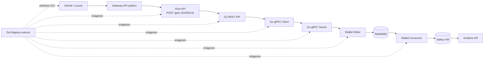

### Flujo de una predicción

1. El cliente envía una solicitud HTTP `POST` a `/grpc-202200141`.
2. El Gateway dirige la solicitud al Service `rust-api`.
3. Rust valida equipos, goles, usuario y timestamp.
4. Rust envía la predicción a `go-rest-api`.
5. Go REST utiliza `go-grpc-client`.
6. El cliente gRPC llama a `go-grpc-server`.
7. El servidor gRPC utiliza `rabbit-writer`.
8. Rabbit Writer publica el mensaje en RabbitMQ.
9. `rabbit-consumer` consume el mensaje.
10. El consumidor actualiza estadísticas y streams en Valkey.
11. Grafana consulta Valkey y presenta los resultados.


---

## 3. Inventario de recursos

### Preparación local

Antes del despliegue en GKE, los servicios fueron desarrollados y probados
localmente.

La estructura local incluye:

- código fuente de Rust;
- servicios desarrollados en Go;
- archivos Dockerfile;
- Docker Compose para pruebas locales;
- manifiestos de Kubernetes;
- archivos cloud-init;
- scripts de Locust;
- configuración descargada como artefacto OCI.

Después de validar el flujo local, se construyeron las imágenes, se etiquetaron
con el carné `202200141` y se publicaron en Zot.


### 3.1 Deployments y contenedores

| Deployment | Contenedores | Función |
|---|---|---|
| `rust-api` | `rust-api` | Entrada pública, validación y envío hacia Go |
| `go-client` | `go-rest-api`, `go-grpc-client` | API REST interna y cliente gRPC |
| `go-server` | `go-grpc-server`, `rabbit-writer` | Servidor gRPC y publicación en RabbitMQ |
| `rabbitmq` | `rabbitmq` | Broker de mensajería |
| `rabbit-consumer` | `rabbit-consumer` | Consumo y almacenamiento en Valkey |

### 3.2 Services

| Service | Puerto | Función |
|---|---:|---|
| `rust-api` | 8081 | Backend del Gateway |
| `go-rest-api` | 8082 | API REST interna |
| `go-grpc-client` | 8083 | Servicio asociado al cliente gRPC |
| `go-grpc-server` | 50051 | Servidor gRPC |
| `rabbit-writer` | 8084 | Publicador hacia RabbitMQ |
| `rabbitmq` | 5672, 15672 | AMQP y consola de administración |
| `valkey-vm-service` | 6379 | Acceso a Valkey |
| `grafana-vm-service` | 3000 | Acceso a Grafana |

### 3.3 Máquinas virtuales KubeVirt

| VM / VMI | Función |
|---|---|
| `valkey-vm` | Ejecuta Valkey con persistencia |
| `grafana-vm` | Ejecuta Grafana y sus dashboards |

### 3.4 Gateway API

| Recurso | Nombre |
|---|---|
| Gateway | `proyecto2-gateway` |
| GatewayClass | `gke-l7-global-external-managed` |
| HTTPRoute | `rust-grpc-route` |
| HealthCheckPolicy | `rust-api-healthcheck` |
| Ruta pública | `/grpc-202200141` |
| Backend | `rust-api:8081` |
| Health check | `/health` |

La IP observada durante la validación fue `8.232.64.139`. Para evitar depender de una IP escrita manualmente, se recomienda obtenerla dinámicamente.


### 3.5RabbitMQ

RabbitMQ funciona como broker principal de mensajería y desacopla la recepción
de predicciones de su procesamiento.

Configuración utilizada:

| Elemento | Valor |
|---|---|
| Service | `rabbitmq` |
| Puerto AMQP | `5672` |
| Puerto de administración | `15672` |
| Cola | `predictions` |
| Secret | `rabbitmq-credentials` |
| PVC | `rabbitmq-data-pvc` |

`rabbit-writer` publica las predicciones en la cola `predictions`.
Posteriormente, `rabbit-consumer` consume cada mensaje y actualiza las
estadísticas almacenadas en Valkey.

El PVC permite conservar la información del broker cuando el Pod de RabbitMQ
es recreado.
---

## 4. Registro externo Zot y artefactos OCI

Se utilizó Zot como registro externo para almacenar las imágenes del proyecto. El registro fue expuesto mediante ngrok.

**Registro:**

```text
dragging-coasting-dawdler.ngrok-free.dev/proyecto2
```

Repositorios verificados:

```text
proyecto2/go-grpc-client
proyecto2/go-grpc-server
proyecto2/go-rest-api
proyecto2/rabbit-consumer
proyecto2/rabbit-writer
proyecto2/rust-api
proyecto2/oci/locust-input
```

El artefacto OCI `proyecto2/oci/locust-input` contiene la configuración empleada por Locust:

```json
{
  "route": "/grpc-202200141",
  "assigned_team": "GTM",
  "allowed_teams": ["GTM", "MEX", "BRA", "ARG", "ESP"],
  "min_goals": 0,
  "max_goals": 5
}
```

### Secret para descargar imágenes

La contraseña no debe escribirse dentro de la documentación. Se utilizó un Secret de tipo `docker-registry`:

```powershell
kubectl create secret docker-registry zot-registry-secret `
  -n proyecto2-202200141 `
  --docker-server="dragging-coasting-dawdler.ngrok-free.dev" `
  --docker-username="<USUARIO_ZOT>" `
  --docker-password="<CONTRASENA_ZOT>"
```

Los Deployments utilizan:

```yaml
imagePullSecrets:
  - name: zot-registry-secret
```
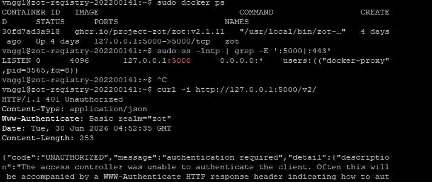
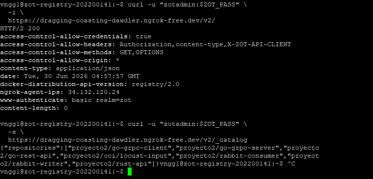
---


## 5. Configuración del servicio Rust y HPA

El servicio Rust utiliza los siguientes recursos:

```yaml
resources:
  requests:
    cpu: 50m
    memory: 64Mi
  limits:
    cpu: 500m
    memory: 256Mi
```

Configuración final del HPA:

```yaml
minReplicas: 1
maxReplicas: 3
averageUtilization: 35
```

Aplicación del manifiesto:

```powershell
kubectl apply -f .\k8s\rust-api.yaml
```

Verificación:

```powershell
kubectl get hpa rust-api -n proyecto2-202200141
kubectl describe hpa rust-api -n proyecto2-202200141
```
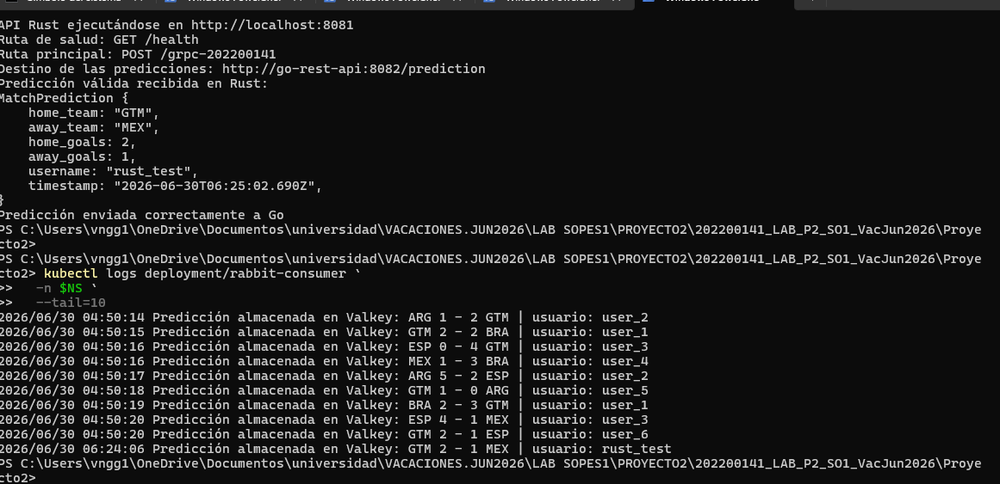


Eventos observados:

```text
1 réplica → 2 réplicas → 3 réplicas
3 réplicas → 2 réplicas → 1 réplica
```


El escalamiento hacia arriba ocurrió cuando la utilización de CPU superó el objetivo de 35 %. El escalamiento hacia abajo ocurrió después de que la carga disminuyó.


---

## 6. Gateway API

Aplicación:

```powershell
kubectl apply -f .\k8s\gateway.yaml
```

Espera de aprovisionamiento:

```powershell
kubectl wait `
  -n proyecto2-202200141 `
  --for=condition=Programmed `
  gateway/proyecto2-gateway `
  --timeout=900s
```

Obtención dinámica de la IP:

```powershell
$GWIP = kubectl get gateway proyecto2-gateway `
  -n proyecto2-202200141 `
  -o jsonpath="{.status.addresses[0].value}"

Write-Host "Gateway IP: $GWIP"
```

Validación:

```powershell
kubectl get gateway -A
kubectl get httproute -A
kubectl describe gateway proyecto2-gateway -n proyecto2-202200141
kubectl describe httproute rust-grpc-route -n proyecto2-202200141
kubectl describe healthcheckpolicy rust-api-healthcheck -n proyecto2-202200141
```

Resultados esperados:

```text
Gateway Programmed: True
GatewayHealthy: True
HTTPRoute Accepted: True
HTTPRoute ResolvedRefs: True
HealthCheckPolicy Attached: True
```

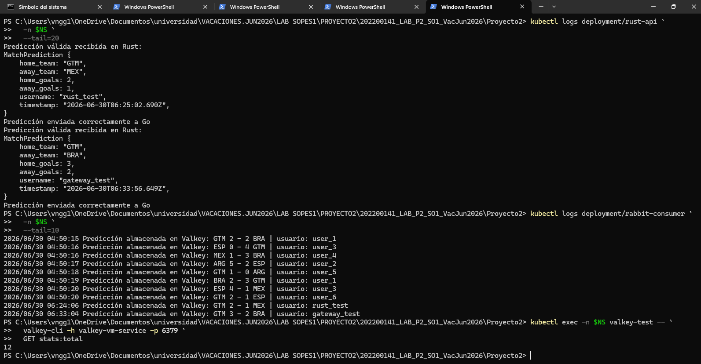
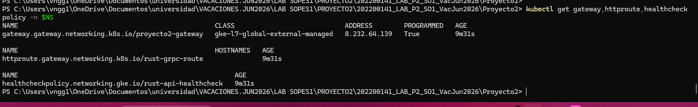
---

## 7. Petición de prueba

```powershell
$GWIP = kubectl get gateway proyecto2-gateway `
  -n proyecto2-202200141 `
  -o jsonpath="{.status.addresses[0].value}"

$body = @{
    home_team  = "GTM"
    away_team  = "MEX"
    home_goals = 2
    away_goals = 1
    username   = "prueba_calificacion"
    timestamp  = (Get-Date).ToUniversalTime().ToString(
        "yyyy-MM-ddTHH:mm:ss.fffZ"
    )
} | ConvertTo-Json

Invoke-RestMethod `
  -Method Post `
  -Uri "http://$GWIP/grpc-202200141" `
  -ContentType "application/json" `
  -Body $body
```

Respuesta esperada:

```text
status  message
------  -------
success Predicción recibida por Rust y enviada correctamente a Go
```

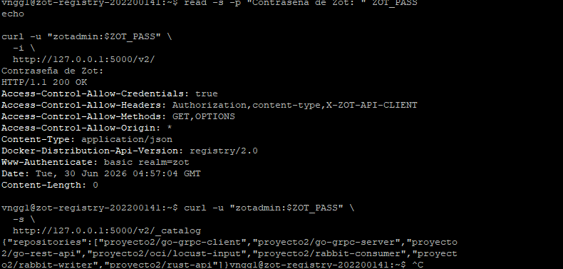
---

## 8. Comandos de validación para la calificación

Para evitar errores provocados por variables no definidas en terminales distintas, se utiliza el namespace explícito.

### 8.1 Estado general

```powershell
kubectl get pods -A
kubectl get deployments -A
kubectl get services -A
kubectl get hpa -A
```

Solo el proyecto:

```powershell
kubectl get deployment,pod,service,hpa `
  -n proyecto2-202200141 `
  -o wide
```

Etiquetas:

```powershell
kubectl get pods `
  -n proyecto2-202200141 `
  --show-labels
```
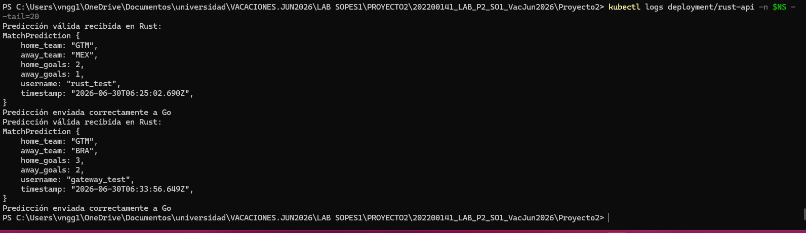
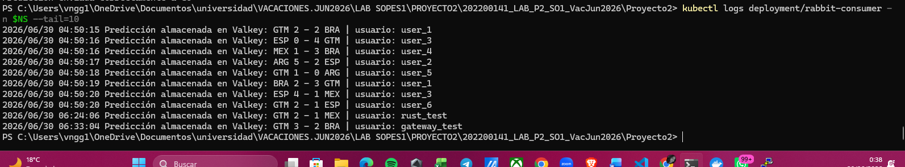

### 8.2 Gateway y HTTPRoute

```powershell
kubectl get gateway -A
kubectl get httproute -A

kubectl describe gateway `
  proyecto2-gateway `
  -n proyecto2-202200141

kubectl describe httproute `
  rust-grpc-route `
  -n proyecto2-202200141

kubectl describe healthcheckpolicy `
  rust-api-healthcheck `
  -n proyecto2-202200141
```

### 8.3 Logs en vivo

#### Rust

```powershell
kubectl logs `
  -n proyecto2-202200141 `
  deployment/rust-api `
  --tail=20 `
  -f
```

#### Go REST

```powershell
kubectl logs `
  -n proyecto2-202200141 `
  deployment/go-client `
  -c go-rest-api `
  --tail=20 `
  -f
```

#### Go gRPC Client

```powershell
kubectl logs `
  -n proyecto2-202200141 `
  deployment/go-client `
  -c go-grpc-client `
  --tail=20 `
  -f
```

#### Go gRPC Server

```powershell
kubectl logs `
  -n proyecto2-202200141 `
  deployment/go-server `
  -c go-grpc-server `
  --tail=20 `
  -f
```

#### Rabbit Writer

```powershell
kubectl logs `
  -n proyecto2-202200141 `
  deployment/go-server `
  -c rabbit-writer `
  --tail=20 `
  -f
```

#### RabbitMQ

```powershell
kubectl logs `
  -n proyecto2-202200141 `
  deployment/rabbitmq `
  --tail=20 `
  -f
```

#### Rabbit Consumer

```powershell
kubectl logs `
  -n proyecto2-202200141 `
  deployment/rabbit-consumer `
  --tail=20 `
  -f
```

`Ctrl+C` detiene el seguimiento de logs.

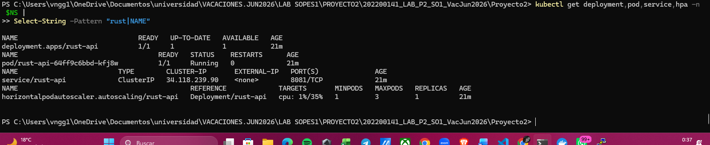


### 8.4 KubeVirt

```powershell
kubectl get vmi -A
```

```powershell
kubectl get vm,vmi,pvc `
  -n proyecto2-202200141 `
  -o wide
```

```powershell
kubectl describe vmi valkey-vm `
  -n proyecto2-202200141

kubectl describe vmi grafana-vm `
  -n proyecto2-202200141
```

## Ejecución de Valkey y Grafana con containerd sobre KubeVirt

KubeVirt permite administrar máquinas virtuales como recursos de Kubernetes.
El proyecto utiliza dos máquinas virtuales independientes:

- `valkey-vm`
- `grafana-vm`

Cada VM utiliza Ubuntu 24.04 como sistema operativo base. Dentro de cada
máquina virtual se instaló containerd para descargar y ejecutar la imagen
correspondiente.

La arquitectura posee dos niveles de ejecución:

```text
Nodo de GKE
└── containerd del nodo
    └── Pod virt-launcher de KubeVirt
        └── Máquina virtual Ubuntu
            └── containerd dentro de la VM
                └── Valkey o Grafana
```

### Configuración mediante cloud-init
Los Secrets de cloud-init contienen las instrucciones utilizadas para
configurar automáticamente cada máquina virtual durante su arranque.

Estas instrucciones permiten:

- configurar el hostname;
- crear el usuario de administración;
- instalar containerd;
- preparar y montar los discos persistentes;
- descargar las imágenes OCI;
- crear los servicios de systemd;
- iniciar los contenedores de Valkey y Grafana.


La VM de Valkey utiliza el Secret:

```text
valkey-cloud-init
```

La VM de Grafana utiliza el Secret:
```text
grafana-cloud-init
```

### 8.5 HPA

```powershell
kubectl get hpa rust-api `
  -n proyecto2-202200141
```

```powershell
kubectl describe hpa rust-api `
  -n proyecto2-202200141
```

Filtrar eventos:

```powershell
kubectl describe hpa rust-api `
  -n proyecto2-202200141 |
Select-String `
  -Pattern "SuccessfulRescale|New size|Events" `
  -Context 0,3
```

---

## 9. Persistencia de Valkey


### Valkey sobre containerd

Valkey se ejecuta dentro de VM KubeVirt, `valkey-vm` utilizando la imagen:

```text
docker.io/valkey/valkey:9.0.4-alpine
```

El contenedor se identifica como: *valkey-202200141*, se verificó mediante:
```text
sudo systemctl is-active containerd
sudo ctr images list | grep -i valkey
sudo ctr containers list | grep -i valkey
sudo ctr tasks list | grep -i valkey
```

```text
containerd: active
imagen: docker.io/valkey/valkey:9.0.4-alpine
contenedor: valkey-202200141
runtime: io.containerd.runc.v2
estado: RUNNING
```
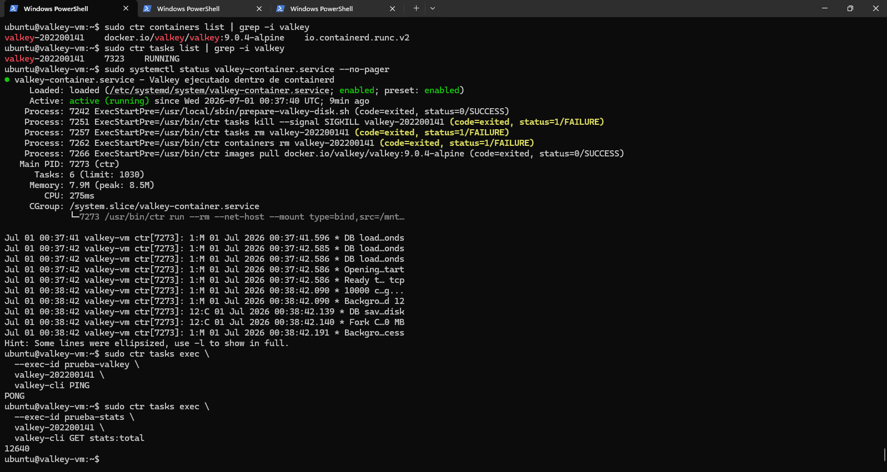


Valkey utiliza un PVC montado como disco de datos. El almacenamiento fue configurado con AOF:

```text
appendonly yes
appendfsync everysec
dir /data
```

Se validó la persistencia mediante:

1. Escritura de una clave.
2. Reinicio de la VMI.
3. Lectura de la clave después del reinicio.

Comandos de consulta:

```powershell
kubectl exec `
  -n proyecto2-202200141 `
  valkey-test -- `
  valkey-cli `
  -h valkey-vm-service `
  -p 6379 `
  GET stats:total
```

Últimas predicciones de Guatemala como local:

```powershell
kubectl exec `
  -n proyecto2-202200141 `
  valkey-test -- `
  valkey-cli `
  -h valkey-vm-service `
  -p 6379 `
  XREVRANGE stream:GTM:home + - COUNT 5
```

Verificación del AOF:

```text
aof_enabled:1
aof_last_write_status:ok
```


`valkey-test` es un Pod temporal utilizado únicamente como cliente para
ejecutar `valkey-cli` dentro de la red del clúster. Valkey no se ejecuta
en este Pod; el servidor real se encuentra dentro de `valkey-vm`.
---

## 10. Grafana

Grafana se ejecuta en `grafana-vm`. Dentro de la máquina virtual,
containerd descarga y ejecuta la imagen de Grafana en el puerto 3000.

La ejecución se verifica mediante:

```bash
sudo systemctl is-active containerd
sudo ctr images list | grep -i grafana
sudo ctr containers list | grep -i grafana
sudo ctr tasks list | grep -i grafana
sudo ss -lntp | grep 3000
```

La tarea de Grafana debe aparecer en estado RUNNING. Cuando se ejecuta:

```bash
sudo ctr images list | grep -i grafana
```
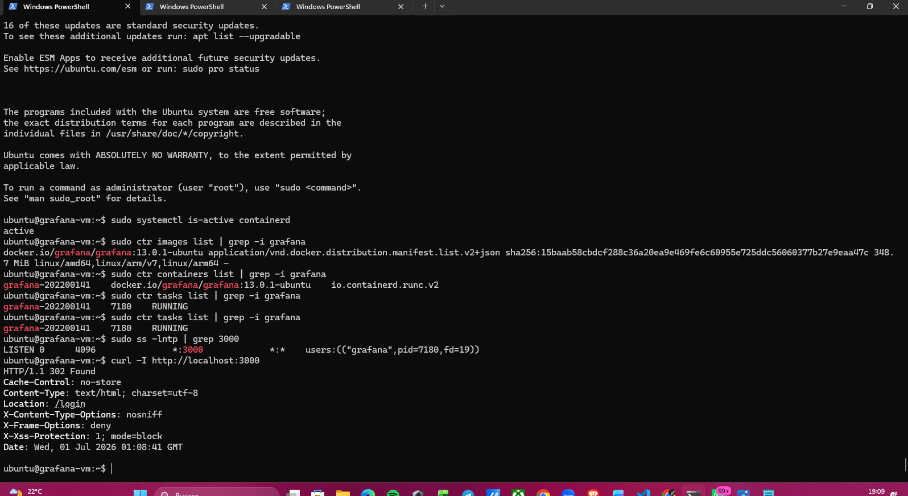


Acceso:

```powershell
kubectl port-forward `
  -n proyecto2-202200141 `
  service/grafana-vm-service `
  3000:3000
```

Abrir:

```powershell
Start-Process "http://localhost:3000"
```

El dashboard incluye:

- Equipo asignado `GTM`.
- Máximo de goles como local.
- Máximo de goles como visitante.
- Mínimo de goles como local.
- Mínimo de goles como visitante.
- Moda como local.
- Moda como visitante.
- Total de predicciones relacionadas con GTM.
- Top de equipos.
- Top de usuarios.
- Series temporales para GTM como local y visitante.


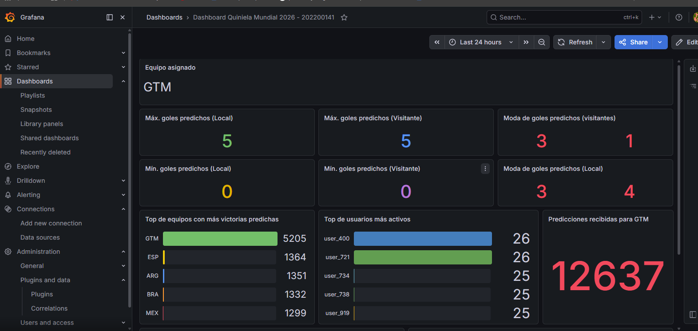
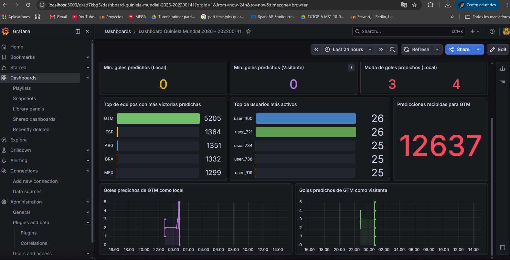
---

## 11. Pruebas de rendimiento con Locust

### 11.1 Ejecución local

Versión utilizada:

```powershell
& ".\locust\.venv\Scripts\python.exe" `
  -m locust `
  --version
```

Resultado:

```text
Locust 2.44.4
```


### 11.2 Prueba con una réplica
Para el primer escenario, el Deployment `rust-api` se ejecutó con una sola
réplica. En la evidencia se observa:

- Deployment disponible `1/1`.
- Una réplica activa.
- Un único Pod de `rust-api`.
- Resultados de Locust para 50 usuarios durante 60 segundos.

Configuración:

```text
Usuarios: 50
Spawn rate: 5 usuarios/s
Duración: 60 s
Réplicas de Rust: 1
```

Comando:

```powershell
& ".\locust\.venv\Scripts\python.exe" `
  -m locust `
  -f .\locust\locustfile.py `
  --headless `
  --host "http://8.232.64.139" `
  --users 50 `
  --spawn-rate 5 `
  --run-time 60s `
  --csv ".\docs\performance\rust-1-replica" `
  --csv-full-history `
  --html ".\docs\performance\rust-1-replica.html" `
  --only-summary
```
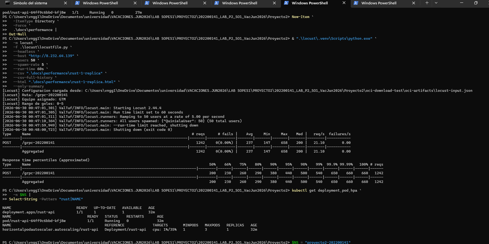


### 11.3 Prueba con dos réplicas
Para el segundo escenario, el Deployment `rust-api` se ejecutó con dos
réplicas. En la evidencia se observa:

- Deployment disponible `2/2`.
- Dos réplicas activas.
- Dos Pods distintos de `rust-api`.
- Resultados de Locust utilizando la misma carga y duración de la prueba anterior.

Configuración:

```text
Usuarios: 50
Spawn rate: 5 usuarios/s
Duración: 60 s
Réplicas de Rust: 2
```

Comando:

```powershell
& ".\locust\.venv\Scripts\python.exe" `
  -m locust `
  -f .\locust\locustfile.py `
  --headless `
  --host "http://8.232.64.139" `
  --users 50 `
  --spawn-rate 5 `
  --run-time 60s `
  --csv ".\docs\performance\rust-2-replicas" `
  --csv-full-history `
  --html ".\docs\performance\rust-2-replicas.html" `
  --only-summary
```

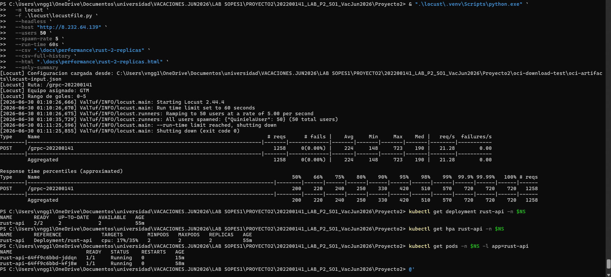

### 11.4 Comparación

| Métrica | 1 réplica | 2 réplicas | Resultado |
|---|---:|---:|---|
| Solicitudes | 1242 | 1258 | +1.29 % |
| Fallos | 0 | 0 | Sin fallos |
| Solicitudes/s | 21.10 | 21.28 | +0.85 % |
| Promedio | 237 ms | 224 ms | Mejora de 5.49 % |
| Mediana | 200 ms | 190 ms | Mejora de 5.00 % |
| Percentil 95 | 440 ms | 420 ms | Mejora de 4.55 % |
| Máximo | 658 ms | 723 ms | Valor aislado mayor |

La segunda réplica redujo el tiempo promedio y el percentil 95. El incremento de solicitudes por segundo fue moderado porque cada usuario espera entre uno y tres segundos entre solicitudes.
Esta comparación adicional se realizó sobre el Deployment de Rust. La prueba de HPA también utilizó Rust por ser el componente configurado para escalamiento automático.

### 11.5 Prueba de HPA

Configuración:

```text
Usuarios: 100
Spawn rate: 10 usuarios/s
Duración: 4 minutos
HPA: mínimo 1, máximo 3, objetivo 35 %
```

Comando:

```powershell
& ".\locust\.venv\Scripts\python.exe" `
  -m locust `
  -f .\locust\locustfile.py `
  --headless `
  --host "http://8.232.64.139" `
  --users 100 `
  --spawn-rate 10 `
  --run-time 4m `
  --csv ".\docs\performance\rust-hpa-auto" `
  --csv-full-history `
  --html ".\docs\performance\rust-hpa-auto.html" `
  --only-summary
```

Resultados:

| Métrica | Valor |
|---|---:|
| Solicitudes | 7887 |
| Fallos | 0 |
| Solicitudes/s | 32.99 |
| Promedio | 960 ms |
| Percentil 95 | 1200 ms |
| Máximo | 4297 ms |

El HPA escaló automáticamente hasta tres Pods y posteriormente regresó a una réplica.

### 11.6 Interfaz gráfica de Locust

Inicio:

```powershell
$GWIP = kubectl get gateway proyecto2-gateway `
  -n proyecto2-202200141 `
  -o jsonpath="{.status.addresses[0].value}"

& ".\locust\.venv\Scripts\python.exe" `
  -m locust `
  -f .\locust\locustfile.py `
  --host "http://$GWIP"
```

Abrir:

```powershell
Start-Process "http://localhost:8089"
```

Configuración utilizada para la demostración:

```text
Users: 100
Spawn rate: 10
Host: http://8.232.64.139
```

---

## 12. Evidencias

### 12.1 Locust y escalamiento del HPA

La siguiente captura muestra Locust enviando solicitudes y el HPA aumentando la cantidad de réplicas cuando la CPU superó el objetivo de 35 %.

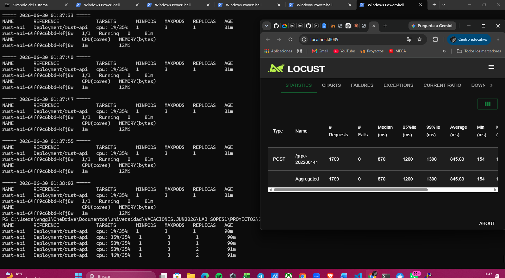

---

## 13. Conclusiones

La solución implementada cumple con el flujo distribuido requerido. El Gateway expone una ruta pública y dirige las solicitudes a Rust. Los servicios internos en Go procesan la predicción mediante REST y gRPC, RabbitMQ desacopla el procesamiento y el consumidor almacena los resultados en Valkey.

Las pruebas de carga finalizaron sin solicitudes fallidas. La comparación entre una y dos réplicas mostró una reducción en el tiempo promedio y en el percentil 95. El HPA reaccionó al aumento de CPU, escaló hasta tres Pods y posteriormente regresó a una réplica.

KubeVirt permitió ejecutar Valkey y Grafana en máquinas virtuales dentro del clúster. La persistencia de Valkey fue validada mediante reinicio de la VMI y recuperación de la información. Grafana permitió visualizar estadísticas, rankings y series temporales.

---

